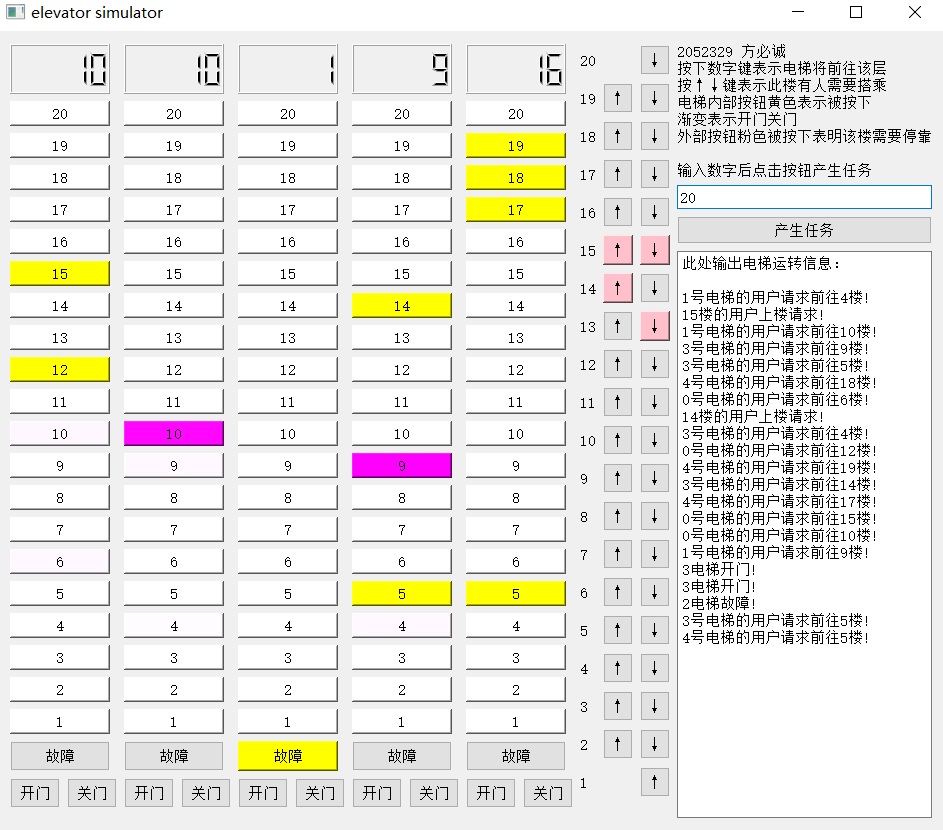
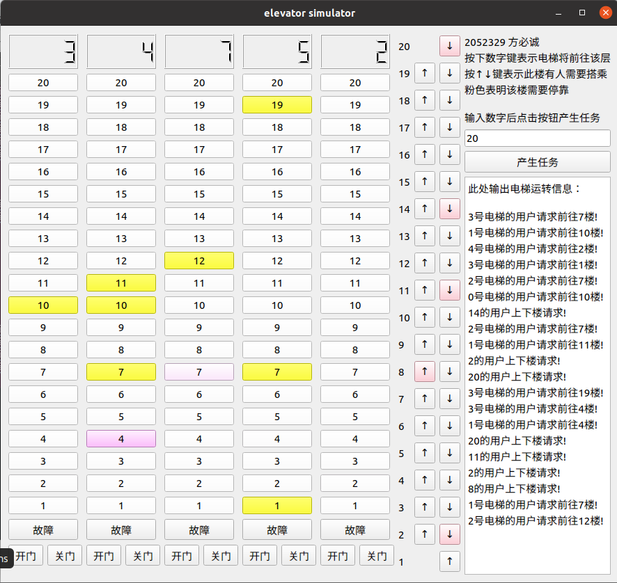

# 电梯调度 说明文档

## 项目说明

同济大学2022年春季学期操作系统课程项目一

本项目通过模拟调度高度为20层的5座电梯，以实现操作系统调度过程，并且掌握一定的多线程编程方法，同时学习一部分调度算法。项目通过PyQt5实现图形化界面，以加强可视性


### 项目界面

- 项目窗口左侧为5台20层电梯的示意图，其中上方的LCD数字表示电梯当前所在楼层。
- 1~20的数字键既模拟电梯的各个楼层开关门，也表示内部的按钮。当数字键被按下时，该数字会变为黄色；当电梯运转到该楼时，按钮颜色会渐变成紫色，随后渐变为白色，表示该层的开门和关门。
- 数字键下方的故障键，开门键，和关门键，分别对应于电梯内部相应的按钮。
- 故障键按下后，电梯会一直处于故障状态（变为黄色），原先分配的任务也会重新分配；再按下则恢复正常
- 中间是外部的上下键按钮，按下后会变为粉色，完成后会变回原来的颜色。
- 右上角为项目简明说明
- 右边中间有一个产生任务的功能，在文本框中输入一个大于零的整数，点击“产生任务”按钮，即可产生相应数量的任务（30%按外部按钮，70%按内部按钮）
- 右下角为消息输出台，输出各种消息


### 项目功能

- 按下数字键后即可到达对应楼层
- 按下上下键后即可调度电梯到对应的楼层
- 当电梯处于门开关的状态时，按下开关门键可控制门的开关（默认开关门1000ms，维持1000ms）
- 按下故障键后，电梯将停止运行，原先分配给它的任务也会重新分配给其他电梯；再按下后恢复正常。
- 输入数字后按下“产生任务”按钮，即可模拟一批乘客


### 项目环境

- 开发环境

  - 系统：Windows 10 家庭中文版
  - IDE：PyCharm Community Edition 2022.1
  - Python 解释器：通过conda部署Python环境
    其中Python版本为3.8，且已通过pip安装了PyQt5

- 运行方式

  - 直接运行
    已经通过`pyinstaller`生成了Windows上的可执行文件。
    在Windows系统上点击`elevator_simulator.exe`，即可运行程序
    
  - 编译运行
  
    * Python version：3.8
  
    * 安装PyQt5
  
      ```bash
      pip install PyQt5
      ```
  
    - 运行源码
  
      ```bash
      git clone https://github.com/Baokker/elevator_project.git # 源码已上传至GitHub
      cd elevator_project
      python elevator_simulator.py
      ```


## 功能实现

### 简要描述

根据现实中电梯的运转状况及需求，可抽象出以下三类对象：

- 乘客（生产者）。乘客在电梯外部或内部按下按钮，产生指令，表示他们的需求。
- 处理者。这里主要是针对乘客在电梯外部按下的按钮。由于乘客在外部按下按钮时，不同电梯与之距离不同，且运行方向不一定与其期望的运行方向相同，因此，有必要设置专门的处理者，用于调度外部任务，选择距离最短的电梯接收任务，以减少等待时间
- 电梯（消费者）。电梯可直接处理乘客在电梯内部按下的按钮，同时也会接收来自处理者调度后的请求。

一般有如下电梯调度算法：

- **先来先服务算法（FCFS）**。该算法根据乘坐电梯的先后次序调度，虽然公平、简单，但是一旦载荷较大，就会严重增加等待时间
- **最短寻找楼层时间优先算法（SSTF）**。该算法每次寻找可以最快满足的楼层，这样可以减少等待时间，但部分楼层（如顶楼和1楼）可能长时间无法响应，出现类似于操作系统中“饥饿”（starvation）的现象
- **扫描算法（SCAN）**。该算法使电梯在最底层和最顶层之间连续往返，所有方向相同的请求在一趟中完成，以确保总体等待时间的稳定。
- **LOOK 算法**。该算法对扫描算法改进，当电梯发现移动方向上不再有目标时立即改变方向。

本项目的电梯调度算法基本基于LOOK算法。区别在于，在本项目中，电梯发现移动方向上无目标时，不会立即改变运行方向，而是等到反方向产生任务后方改变运行方向


### 类

为描述电梯的运行，构建了以下类：

| 类名           | 作用                                                         |
| -------------- | ------------------------------------------------------------ |
| ElevatorState  | 描述电梯的状态，包括正常、开门中、开门、关门中、上行中、下行中、故障 |
| MoveState      | 电梯的扫描移动状态，包括向上、向下                           |
| OuterTaskState | 外部按钮产生的任务的分配状态，包括未分配、等待、完成         |
| OuterTask      | 描述外部按钮按下产生的任务，包括目标楼层、需要的电梯运行方向、以及该任务是否完成 |

在此基础上，构建了三个类用于完成电梯调度：

| 类名       | 作用                                                         |
| ---------- | ------------------------------------------------------------ |
| ElevatorUi | 初始化UI界面，同时接收来自外界的输入（即按下按钮），相当于生产者。接收的输入包括外部上下行按钮，内部的故障按钮，数字按钮，开门按钮和按钮按钮 |
| Handler    | 继承QThread类，用于接收外部按钮产生的任务，并调度给合适的电梯。当任务完成后，将其移出队列 |
| Elevator   | 继承QThread类，用于表示实际运行的电梯（相当于消费者），其功能包括使电梯移动一层楼，让电梯根据任务开关门，等等 |


### 全局变量

首先是描述电梯运行状态的常量

| 变量名            | 作用                                      |
| ----------------- | ----------------------------------------- |
| ELEVATOR_NUM      | 电梯数量                                  |
| ELEVATOR_FLOORS   | 电梯层数                                  |
| TIME_PER_FLOOR    | 电梯上行/下行一楼所需的时间（单位：毫秒） |
| OPENING_DOOR_TIME | 打开一扇门所需时间（单位：毫秒）          |
| OPEN_DOOR_TIME    | 门打开后维持的时间（单位：毫秒）          |

其次是一些用于生产者（`ElevatorUI`），调度者（`Handler`），消费者（`Elevator`）的共享全局变量：

| 变量名                  | 作用                                                         |
| ----------------------- | ------------------------------------------------------------ |
| outer_requests          | 外部按钮产生的需求                                           |
| elevator_states         | 每组电梯的状态                                               |
| cur_floor               | 每台电梯的当前楼层                                           |
| up_targets              | 每台电梯当前需要向上运行处理的目标有哪些（二维数组，内部仅为数字） |
| down_targets            | 每台电梯当前需要向下运行处理的目标有哪些（二维数组，内部仅为数字） |
| is_open_button_clicked  | 每台电梯内部的开门键是否被按（True/False）                   |
| is_close_button_clicked | 每台电梯内部的关门键是否被按（True/False）                   |
| move_states             | 每台电梯当前的扫描运行状态（`MoveState.up` or `MoveState.down`） |
| open_progress           | 每台电梯开门的进度条 范围为0-1的浮点数                       |


### 调度算法

- 针对电梯内部按下的按钮：
  - 若故障键被按下，则`elevator_states`设置为`ElevatorState.fault`；在`elevator`类中，检测到故障变化时，则将所有上行下行任务清除，并将原先分配给该电梯的外部按钮请求重新分配
  - 若开门键、关门键被按下，且电梯正处于开关门状态时，重新计时
  - 若数字键被按下，
    - 若电梯处于故障则不处理
    - 否则根据高低将任务添加到`up_targets`或`down_targets`中
- 针对电梯外部按下的按钮，交由`Handler`处理：
  - 若电梯故障则跳过
  - 若电梯正在上行，则计算距离时将楼层+1；若在下行则-1
  - 计算每台电梯距离乘客的距离。对某一种方向来说，根据这部电梯是否与它运行方向相同，是在上方还是下方，是否有任务，分为8种情况，分成两类计算：
    
    
  - 选取最小者，调配任务
- 针对接收到的任务，电梯：
  - 若故障，则执行`fault_tackle`
  - 若电梯处在向上扫描中，则检查向上的任务队列中有目标时，则向上一层；若到达楼层，则执行开关门操作，同时对已经完成的任务清除
  - 若电梯处在向下扫描状态，则检查向下任务队列，情况大体与上一条相同
  - 在开关门时，可以通过`is_close_button_clicked`和`is_open_button_clicked`来决定开门还是关门


## 项目链接

本项目已发至GitHub：

https://github.com/Baokker/elevator_project


## 项目总结

- 慎用Python的list乘法，例如

  ```python
  a = [1,1,1,1,1]
  b = [1] * 5
  a[0] = 0
  b[0] = 0
  print(a)
  print(b)
  ```

  运行后会发现，`a`仍然为`[0,1,1,1,1]`,`b`则为`[0,0,0,0,0]`。换言之，list乘法是对第一个对象的引用，而非创建新的对象！

- 多线程时一定要注意mutex的lock和unlock，以避免死锁

- 模拟电梯上下时，在让电梯线程睡眠时，一定要把mutex先unlock，不然整个进程都卡在sleep上，别的线程无法获得资源运作


## 运行截图

windows下



Ubuntu下

